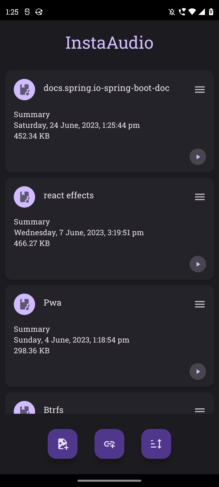
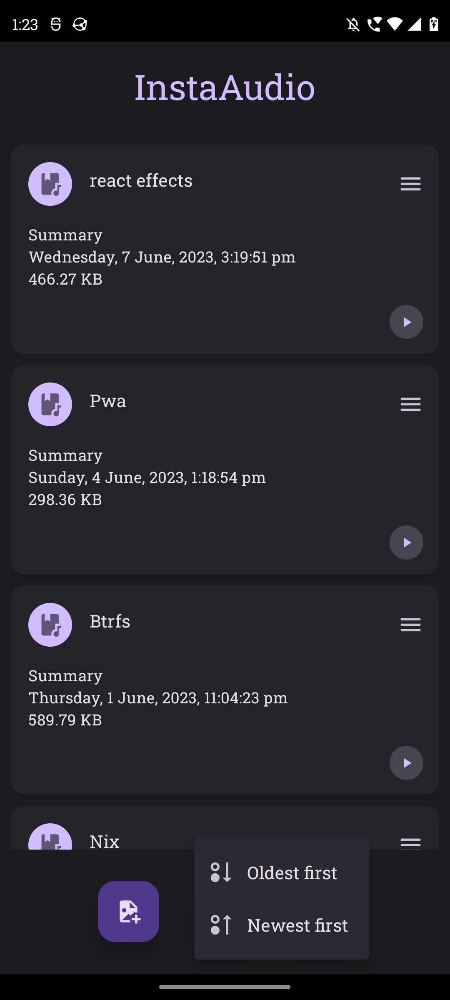
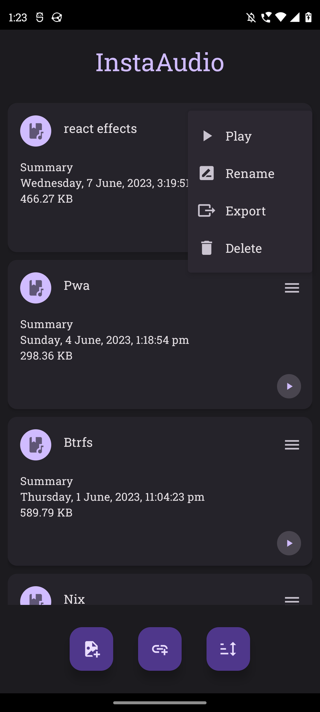

# InstaAudio client

## Features

- Use share intent to open files.
- Open files directly from inside the application.
- Export audio files for backup/sharing etc.
- Currently offloads to external mp3 player.

## Screenshots

---

---

---

